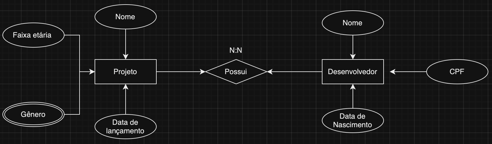
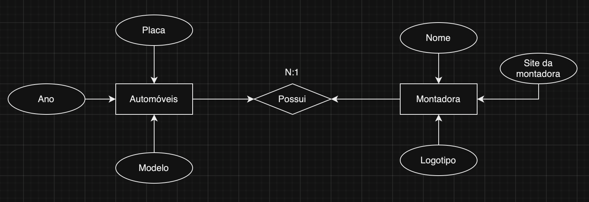
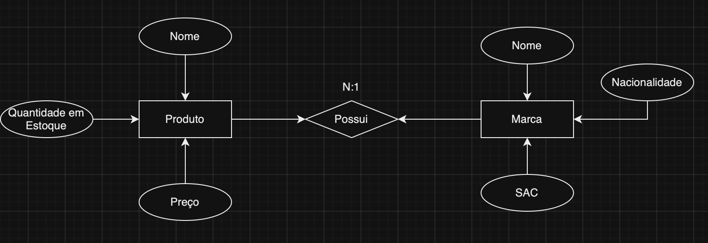
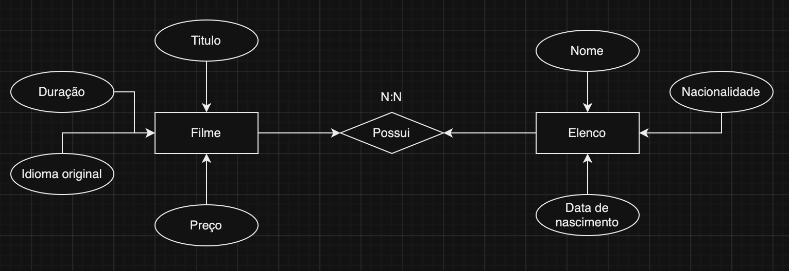

# Exercicios Banco de Dados AC1
## Exercicio 1 - Banco de dados dos alunos
Crie um banco de dados para armazenar dados de alunos. Um aluno deve ter RA, nome, data de nascimento, endereço e e-mail

Codigo:

## Exercicio 2 - Banco de dados dos colaboradores
Crie um banco de dados para armazenar dados de colaboradores de uma empresa. Um colaborador deve ter um código de identificação, nome, CPF, cargo e salário

Codigo:

## Exercicio 3 - Modelo Petshop
Um petshop deseja manter cadastrados seus clientes bem como seus pets.

Um cliente deve informar seu nome, CPF, e-mail e telefone, além do nome, espécie e data de nascimento de seu pet.

### DER:

### Codigo:

## Exercicio 4 - Modelo Estudio de Games
Em uma produtora de games, há desenvolvedores, que possuem um nome, CPF, data de nascimento.

Cada projeto tem um nome, data de lançamento, gênero e faixa etária. Segundo o gerente de projetos, “cada desenvolvedor deve estar envolvido em um projeto”.

### DER:

### Codigo:

## Exercicio 5 - Modelo Biblioteca
Uma biblioteca efetua registro de autores e livros. Um autor é cadastrado com seu nome, e-mail, nacionalidade e data de nascimento. Já um livro é registrado com o título, quantidade de páginas, acabamento e editora.

### DER:

### Codigo:

## Exercicio 6 - Modelo Locadora de Automoveis 
Uma locadora de automóveis, mantém registro dos automóveis. Um automóvel é cadastrado com placa, modelo, ano, nome da montadora, site da montadora, logotipo da montadora.

### DER:

### Codigo:

## Exercicio 7 - Modelo Mercado
Um supermercado cadastra seus produtos. Um produto é identificado por seu nome, preço, quantidade em estoque, nome da marca, SAC da marca, nacionalidade da marca.

### DER:

### Codigo: 

## Exercicio 8 - Modelo Locadora de Filme
Uma videoteca precisa cadastrar o título, duração, idioma original e preço de cada filme. É necessário cadastrar também o elenco de cada filme onde se registra o nome, data de nascimento, nacionalidade de cada ator/atriz. Opcionalmente, inclua o cadastro de diretores com atributos que julgar necessários.

  ### DER:
  

  ### Codigo:
  
